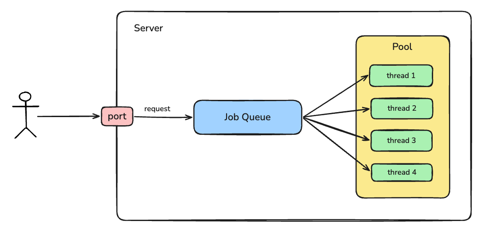

# Thread Pool

This is a simple thread-pool-model-server implementation for handling multiple requests sent to the server at the same moment.

I practice this to get an understanding of the thread-pool model. This might help to brainstorm the idea for my Redis implementation.



The diagram shows a high level design of the server with the thread pool handling multiple incoming requests by creating new threads to pick up the job from a Job Queue (Go channel).

The requests I sent (as client) and their results:
```
$curl http://localhost:3000 http://localhost:3000 http://localhost:3000 http://localhost:3000 http://localhost:3000

Hello Thang
Hello Thang
Hello Thang
Hello Thang
Hello Thang
```

The logs from the server:
```
Worker 0 is handling job from [::1]:63071
Worker 1 is handling job from [::1]:63072
Worker 0 is handling job from [::1]:63074
Worker 1 is handling job from [::1]:63075
Worker 0 is handling job from [::1]:63078
```

It shows that the jobs are picked up by 2 workers one by one, which is expected.